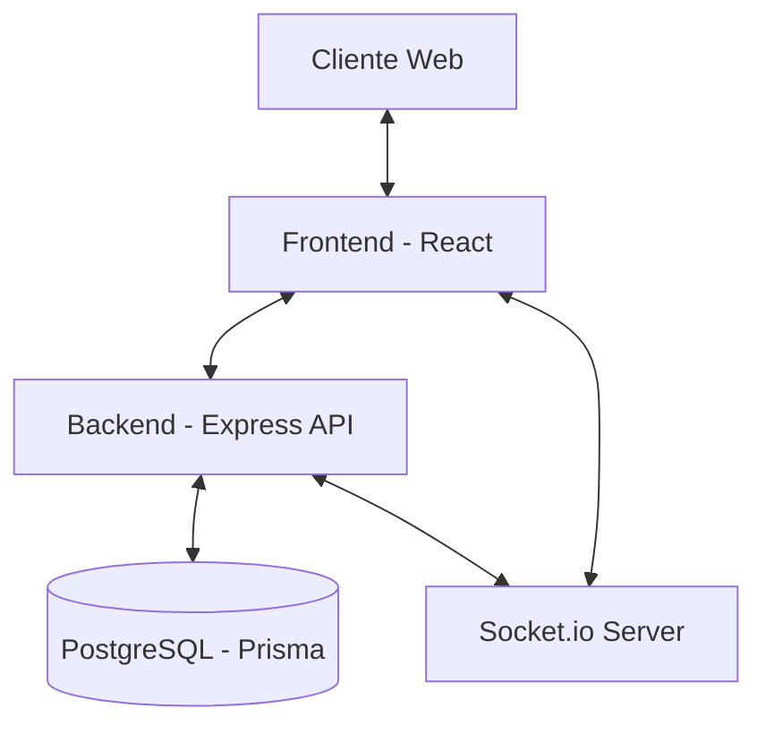

# 🍽️ Restaurant Management System (TFG)

[](LICENSE)
[](https://nodejs.org/)
[](https://reactjs.org/)
[](https://www.prisma.io/)

Una solución integral y moderna para la gestión de reservas, clientes y operaciones de un restaurante. Este proyecto ha sido desarrollado como un **Trabajo de Fin de Grado (TFG)**, enfocándose en la escalabilidad, la experiencia de usuario y la eficiencia operativa.

---

## 🚀 Vista Rápida

Este sistema permite a los restaurantes gestionar su flujo completo de reservas, desde el portal público de clientes hasta un panel de administración avanzado con control de mesas en tiempo real, gestión de turnos y CRM detallado.

### Módulos Principales
- **🌐 Portal Público:** Interfaz intuitiva para que los clientes realicen reservas.
- **🛠️ Panel de Administración:** Gestión completa de reservas, mesas, zonas y configuración del sistema.
- **👥 CRM Avanzado:** Seguimiento detallado de clientes, preferencias, alérgenos y fidelización (VIP).
- **📊 Gestión Operativa:** Control de turnos, cierres temporales y disponibilidad de mesas.
- **📁 Menú Digital:** Gestión de categorías y platos del restaurante.

---

## 🏗️ Arquitectura del Sistema

El proyecto sigue una arquitectura desacoplada de Cliente-Servidor:

- **Backend:** API REST robusta construida con **Node.js** y **Express**, utilizando **Prisma ORM** para la interacción con la base de datos PostgreSQL.
- **Frontend:** Aplicación web reactiva construida con **React 19** y **Vite**, utilizando **TypeScript** para mayor seguridad y mantenibilidad.
- **Comunicación en Tiempo Real:** Implementación de **Socket.io** para actualizaciones instantáneas entre el portal de clientes y el panel de administración.



---

## 🛠️ Stack Tecnológico

### Backend
- **Core:** Node.js, Express.js
- **Base de Datos:** PostgreSQL
- **ORM:** Prisma
- **Validación:** Joi
- **Autenticación:** JSON Web Tokens (JWT) & bcryptjs
- **Logging:** Winston & Morgan
- **Testing:** Vitest

### Frontend
- **Core:** React 19, TypeScript
- **Build Tool:** Vite
- **Estado/Rutas:** React Router 7
- **Estilos:** Vanilla CSS (Moderno)
- **Internacionalización:** i18next (ES, EN, FR)
- **Drag & Drop:** dnd-kit (para gestión de mesas)
- **Comunicación:** Socket.io-client, Axios

---

## 📦 Instalación y Configuración

### Requisitos Previos
- Node.js (>= 18.0.0)
- Docker & Docker Compose (Recomendado para la base de datos)
- npm o yarn

### Pasos Generales
1. **Clonar el repositorio:**
   ```bash
   git clone <repo-url>
   cd TFG
   ```

2. **Configurar variables de entorno:**
   Copia los archivos `.env.example` (si existen) o crea archivos `.env` en la raíz, `/backend` y `/frontend`.

3. **Levantar la infraestructura (Base de Datos):**
   ```bash
   docker-compose up -d
   ```

4. **Instalar dependencias y ejecutar:**
   Sigue las instrucciones detalladas en cada subdirectorio:
   - [Documentación del Backend](./backend/README.md)
   - [Documentación del Frontend](./frontend/README.md)

---

## 📁 Estructura del Proyecto

```text
.
├── backend/            # Lógica de servidor, API y Base de Datos
├── frontend/           # Interfaz de usuario (React)
├── docs/               # Documentación detallada del sistema
├── specs/              # Especificaciones técnicas y planes de desarrollo
└── docker-compose.yml  # Configuración de Docker
```

---

## 📚 Documentación Detallada

Para más información, consulta los siguientes documentos:

- 🏛️ [Arquitectura del Sistema](./docs/ARCHITECTURE.md)
- 🗄️ [Esquema de Base de Datos](./docs/DATABASE_SCHEMA.md)
- 📝 [Funcionalidades e Hitos](./docs/FEATURES.md)
- 🔌 [Referencia de la API](./backend/API.md)

---

## 📜 Licencia

Este proyecto está bajo la protección de **Todos los derechos reservados**. Consulta el archivo [LICENSE](LICENSE) para más detalles.
