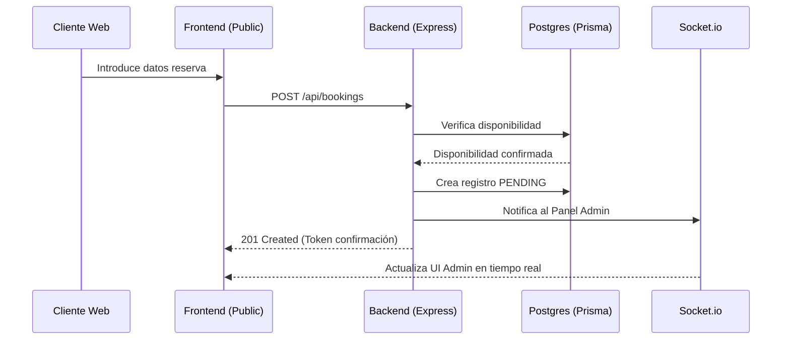

# 🏛️ Arquitectura del Sistema

Este documento describe la arquitectura técnica y los patrones de diseño utilizados en el proyecto.

## 🏗️ Resumen de la Estructura

El sistema está diseñado bajo un patrón **monorepo simplificado** con dos directorios principales: `/backend` y `/frontend`.

### 🗄️ Backend (Node.js & Express)
El backend sigue una arquitectura en capas para separar responsabilidades:

1. **Routes:** Definen los endpoints de la API y agrupan controladores por recurso.
2. **Controllers:** Manejan el flujo de entrada/salida (HTTP requests/responses).
3. **Services:** Lógica de negocio pura. Es donde reside la inteligencia del sistema (ej: lógica de asignación de mesas).
4. **Prisma/Database:** Capa de acceso a datos.

**Patrones Utilizados:**
- **Layered Architecture:** Separación clara entre HTTP y lógica de negocio.
- **Middleware Pattern:** Para validaciones (Joi), autenticación (JWT) y manejo de errores.
- **Service Pattern:** Para facilitar el testing y la reutilización de código.

### 🎨 Frontend (React & TypeScript)
El frontend utiliza un enfoque moderno basado en componentes y hooks funcionales:

1. **Components:** Divididos en `common` (reutilizables) y específicos de vistas (Admin/Public).
2. **Context:** Para el estado global (Autenticación, Idioma).
3. **Services/API:** Capa de comunicación con el backend (Axios).
4. **Types:** Definiciones de interfaces y tipos para asegurar coherencia en el flujo de datos.

---

## 🔄 Flujo de Datos

### Proceso de Reserva (Booking Flow)

---

## 🔌 Integraciones y Servicios Externos

- **Email Service:** El backend utiliza `nodemailer` para el envío de correos electrónicos de confirmación, reconfirmación y recordatorio.
- **WebSockets:** Se utiliza `Socket.io` para que el panel de administración reciba cambios de estado y nuevas reservas sin necesidad de refrescar la página.

---

## 🛡️ Seguridad

- **JWT:** Las rutas de administración están protegidas mediante Bearer Tokens almacenados en el navegador.
- **CORS:** Configurado para permitir únicamente peticiones desde el dominio del frontend.
- **Helmet:** Utilizado en el backend para establecer varias cabeceras HTTP que mejoran la seguridad.
- **Bcryptjs:** Para el hasheo seguro de contraseñas del personal.
