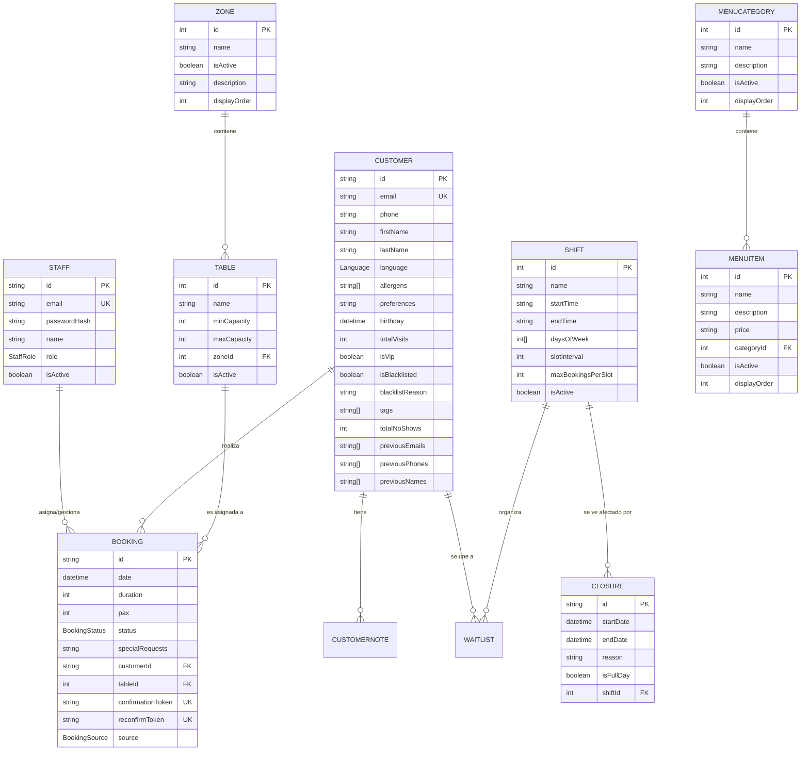

# 🗄️ Esquema de Base de Datos

Este documento detalla el modelo de datos utilizado en el Sistema de Gestión de Restaurantes. La persistencia se gestiona mediante **PostgreSQL** y el acceso a datos se realiza a través de **Prisma ORM**.

## 📊 Diagrama de Entidad-Relación

## 📝 Descripción de Modelos

### 👥 Usuarios y Clientes
- **Staff:** Gestiona el acceso al panel de administración. Los roles pueden ser `ADMIN` o `STAFF`.
- **Customer:** Almacena la información de contacto y perfiles de fidelización. Implementa un sistema de **identidad unificada** que rastrea cambios históricos de emails, teléfonos y nombres para evitar duplicados.

### 📅 Reservas y Flujo de Trabajo
- **Booking:** El núcleo del sistema. Registra fecha, número de comensales (PAX), estado y mesa asignada.
- **Waitlist:** Permite a los clientes apuntarse en una lista de espera cuando no hay disponibilidad inmediata.
- **BookingStatus:** Los estados incluyen `PENDING`, `CONFIRMED`, `RECONFIRMED`, `SEATED`, `COMPLETED`, `CANCELLED`, `NO_SHOW`.

### 🏢 Organización del Local
- **Zone:** Diferentes áreas del restaurante (ej: Terraza, Salón Principal, Barra).
- **Table:** Mesas individuales con capacidades mínimas y máximas definidas.
- **Shift:** Define los horarios de operación y las reglas de reserva (intervalos, máximo de reservas por slot).

### 🍽️ Oferta Gastronómica
- **MenuCategory:** Categorías del menú (ej: Entrantes, Carnes, Postres).
- **MenuItem:** Platos individuales con descripción y precio.

---

## ⚙️ Configuraciones Técnicas
El sistema utiliza un modelo de `SystemConfig` basado en clave-valor para ajustes dinámicos sin necesidad de cambios en el código (ej: tiempo límite de reserva, activación de notificaciones).
