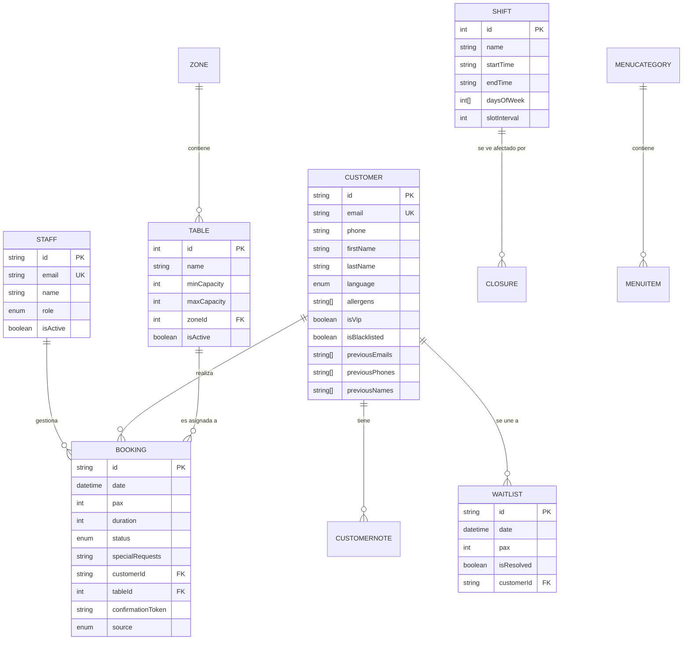
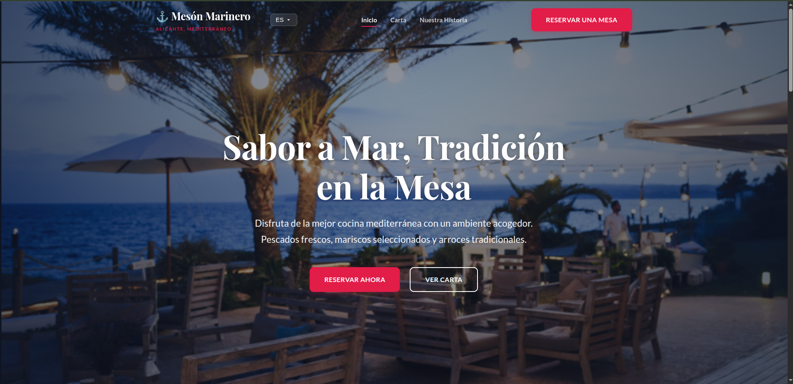
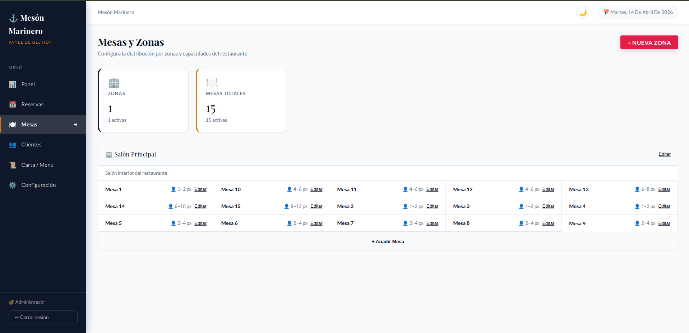
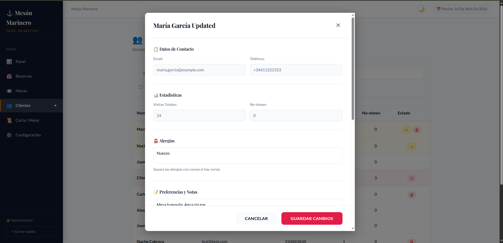
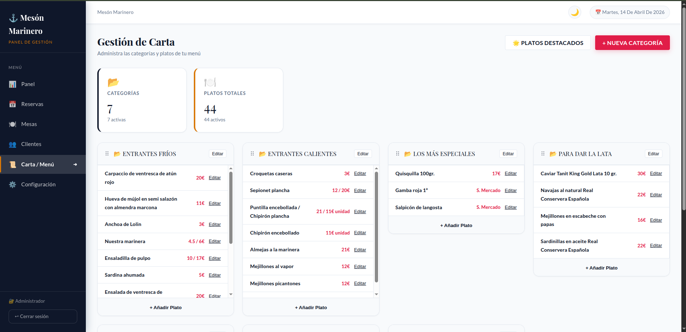

# 📘 Memoria Técnica: Sistema de Gestión de Restaurantes (TFG)

Este documento proporciona una visión detallada y exhaustiva del proyecto, cubriendo desde la arquitectura técnica hasta los casos de uso y el modelo de datos.

---

## 1. 🎯 Resumen del Proyecto
El **Sistema de Gestión de Restaurantes** es una solución integral diseñada para digitalizar y optimizar las operaciones diarias de un establecimiento de hostelería. El sistema permite gestionar de manera eficiente el flujo de reservas, la ocupación de mesas en tiempo real, la fidelización de clientes (CRM) y la configuración dinámica del local.

Su objetivo principal es mejorar la experiencia del cliente mediante un portal de reservas intuitivo y proporcionar al personal una herramienta robusta para la gestión operativa, reduciendo errores humanos y maximizando la capacidad del local.

---

## 2. 🛠️ Tecnologías Utilizadas

### Backend
- **Core:** Node.js v18+ y Express.js
- **Lenguaje:** JavaScript (ES6+)
- **Base de Datos:** PostgreSQL v16
- **ORM:** Prisma (Type-safe database access)
- **Comunicación en Tiempo Real:** Socket.io
- **Autenticación:** JSON Web Tokens (JWT) & bcryptjs
- **Validación:** Joi
- **Envío de Emails:** Nodemailer

### Frontend
- **Framework:** React 19
- **Build Tool:** Vite
- **Lenguaje:** TypeScript / JavaScript (CSS Vanilla)
- **Gestión de Estado y Rutas:** React Router 7
- **Internacionalización:** i18next (Soporte ES, EN, FR)
- **Drag & Drop:** dnd-kit (para gestión visual de mesas)
- **Estilos:** CSS3 Moderno (Variables CSS, Flexbox, Grid)

### DevOps e Infraestructura
- **Contenedores:** Docker & Docker Compose
- **Entorno de Datos:** pgAdmin 4 (Administración visual de BD)

---

## 3. 👥 Roles de Usuario y Casos de Uso

El sistema define tres roles principales, cada uno con interacciones específicas:

### 🌐 Cliente (Guest)
El usuario final que interactúa con el portal público.
- **Caso de Uso 1:** Realizar una reserva seleccionando fecha, hora y número de comensales.
- **Caso de Uso 2:** Consultar el menú digital del restaurante en su idioma preferido.
- **Caso de Uso 3:** Confirmar o cancelar una reserva a través de un enlace de correo electrónico.
- **Caso de Uso 4:** Unirse a la lista de espera cuando no hay disponibilidad inmediata.

### 👤 Personal (Staff)
Usuarios encargados de la operativa diaria del restaurante.
- **Caso de Uso 1:** Gestionar el flujo de reservas (Confirmar, Sentar, Finalizar).
- **Caso de Uso 2:** Asignar y mover reservas entre mesas de forma visual.
- **Caso de Uso 3:** Consultar el historial y preferencias de un cliente antes de su llegada.
- **Caso de Uso 4:** Registrar reservas manuales (telefónicas o presenciales).

### 🔑 Administrador (Admin)
Usuario con control total sobre la configuración del sistema.
- **Caso de Uso 1:** Configurar turnos (Shifts), horarios y límites de capacidad.
- **Caso de Uso 2:** Gestionar la distribución del local (Zonas y Mesas).
- **Caso de Uso 3:** Administrar el catálogo del menú (Categorías y Platos).
- **Caso de Uso 4:** Gestionar las cuentas del personal y configuraciones globales del sistema.

---

## 4. 🗄️ Modelo Entidad-Relación (ER)

El siguiente diagrama representa la estructura de la base de datos y las relaciones entre entidades:



---

## 5. 📑 Descripción de Tablas Principales

| Tabla | Propósito |
| :--- | :--- |
| `Staff` | Usuarios del sistema con acceso al panel (Admin/Staff). |
| `Customer` | Perfiles de clientes con historial, preferencias e identidad unificada. |
| `CustomerNote` | Notas internas del personal sobre clientes específicos. |
| `Booking` | Registros de reservas con fecha, estado y asociación a mesas. |
| `Table` | Entidades físicas del restaurante con capacidades específicas. |
| `Zone` | Áreas geográficas del local (Terraza, Salón, etc.). |
| `Shift` | Definición de horarios de apertura y reglas de reserva. |
| `Waitlist` | Clientes en espera de una cancelación para obtener mesa. |
| `MenuCategory` | Clasificaciones del menú (Entrantes, Carnes, etc.). |
| `MenuItem` | Platos individuales con precio y descripción. |
| `Closure` | Bloqueos temporales de fechas o turnos (festivos, eventos). |
| `SystemConfig` | Ajustes globales dinámicos (tiempos, políticas, etc.). |

---

## 6. 🐳 Dockerización del Sistema

El proyecto está completamente preparado para ejecutarse en entornos aislados mediante **Docker Compose**. La configuración incluye:

- **Contenedor BD:** PostgreSQL 16 con persistencia de datos en volúmenes.
- **Contenedor Backend:** Node.js configurado para auto-recarga en desarrollo.
- **Contenedor Frontend:** Entorno Vite para desarrollo reactivo.
- **Contenedor pgAdmin:** Interfaz web para gestión de la base de datos.

### Comandos de ejecución:
```bash
# Iniciar todo el sistema
docker-compose up -d

# Ver logs del backend
docker-compose logs -f backend
```

---

## 🚀 7. Guía de Despliegue y Producción

El sistema está diseñado para ser desplegado en entornos modernos de nube mediante una arquitectura desacoplada:

### Frontend (Producción)
1. **Compilación:** `npm run build` genera una carpeta `dist/` optimizada.
2. **Hosting:** Recomendado **Vercel** o **Netlify** por su soporte nativo de React y manejo de variables de entorno.
3. **Optimización:** Las imágenes estáticas deben servirse mediante un CDN o optimizarse antes del despliegue.

### Backend (Producción)
1. **Infraestructura:** Recomendado **Render**, **Railway** o **AWS EC2**.
2. **Base de Datos:** PostgreSQL gestionado en **Supabase** o **PostgreSQL administrado de AWS**.
3. **Variables Críticas:** Asegurar la configuración de `JWT_SECRET`, `DATABASE_URL` y credenciales SMTP.
4. **Ejecución:** Utilizar gestores de procesos como **PM2** o ejecutar dentro de contenedores Docker.

### Pipeline CI/CD (Opcional)
Se recomienda el uso de **GitHub Actions** para:
- Ejecución automática de tests con Vitest.
- Build y despliegue continuo al fusionar cambios en la rama `main`.

---

## 📸 8. Capturas de Pantalla Significativas

A continuación se presentan las interfaces clave del sistema:

### Interfaz Pública (Portal de Reservas)

*Descripción: Pantalla principal donde el cliente puede ver la propuesta gastronómica y comenzar el proceso de reserva.*

### Panel de Administración (Gestión de Mesas)

*Descripción: Mapa interactivo del restaurante donde el personal gestiona la ocupación en tiempo real.*

### Gestión de Clientes (CRM)

*Descripción: Vista detallada de un cliente, mostrando su historial de visitas, alérgenos y etiquetas VIP.*

### Configuración del Menú

*Descripción: Interfaz para añadir, editar o desactivar platos y categorías del menú digital.*
